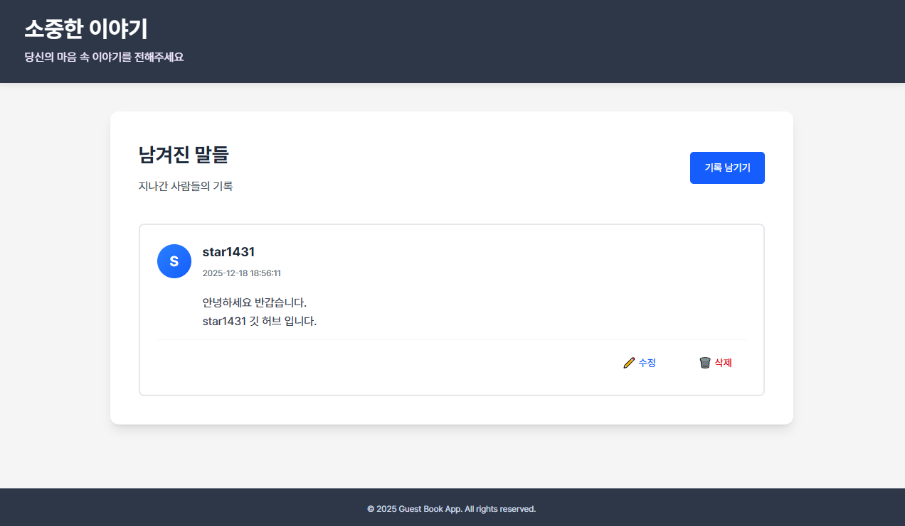

# 개인 연습 - Guest Book App

Spring Boot와 Next.js를 활용한 풀스택 방명록 CRUD



---

## 프로젝트 개요

- **백엔드**: Spring Boot 기반 RESTful API
- **프론트엔드**: Next.js 기반 웹 인터페이스
- **데이터베이스**: MySQL 8.0

---

## 관련 기술 스택

### Backend
- Java 21
- Spring Boot 4.0.0
- Spring Data JPA
- MySQL 8.0
- Gradle

### Frontend
- Next.js
- React
- Tailwind CSS

### Infrastructure
- Docker
- Docker Compose

---

## docs 문서

프로젝트 관련 상세 문서는 `docs/` 폴더를 참고

- **프로젝트 설계**: [docs/01-project-design.md](./docs/01-project-design.md)
- **API 명세서**: [docs/02-api-spec.md](./docs/02-api-spec.md)
- **Docker 구성**: [docs/03-docker.md](./docs/03-docker.md)
- **AWS 배포**: [docs/04-deploy.md](./docs/04-deploy.md)
- **CI/CD 자동화**: [docs/05-cicd.md](./docs/05-cicd.md)
- **회고 문서**: [docs/06-retrospective.md](./docs/06-retrospective.md)

---

## 프로젝트 구조

```
guest-book-app/
├── backend/              # Spring Boot 백엔드
│   ├── src/
│   ├── Dockerfile
│   ├── build.gradle
│   └── README.md
│ 
├── frontend/             # Next.js 프론트엔드
│   ├── app/
│   ├── Dockerfile
│   ├── package.json
│   └── README.md
│ 
├── docker-compose.yml    # Docker Compose 설정
│ 
├── docs/                 # 프로젝트 문서 모음
│   ├── 01-project-design.md
│   ├── 02-api-spec.md
│   ├── 03-docker.md
│   ├── 04-deploy.md
│   ├── 05-cicd.md
│   └── 06-retrospective.md
│ 
└── README.md
```

---

## Local 실행시

### 백엔드 실행

백엔드 관련 상세 정보는 [backend/README.md](./backend/README.md) 참고

```bash
cd backend
./gradlew bootRun
```

### 프론트엔드 실행

프론트엔드 관련 상세 정보는 [frontend/README.md](./frontend/README.md) 참고

```bash
cd frontend
npm install
npm run dev
```

---

## Docker 실행시

- `.env` 민감정보 작성 필요 (gitignore 상태)

```bash
# .env
MYSQL_ROOT_PASSWORD=
MYSQL_DATABASE=
MYSQL_USER=
MYSQL_PASSWORD=
CORS_URL=http://localhost:3000
```

- 실행

```bash
docker-compose up -d --build
```


---


## 보안 관련

- `application.yml` 및 민감한 설정 파일은 `.gitignore`에 포함
- 환경변수 관련 로컬용/EC2용 분리하여 관리
    - 로컬 : 최상위 루트  내 `.env`
    - EC2 : EC2 폴더 내 `.env`