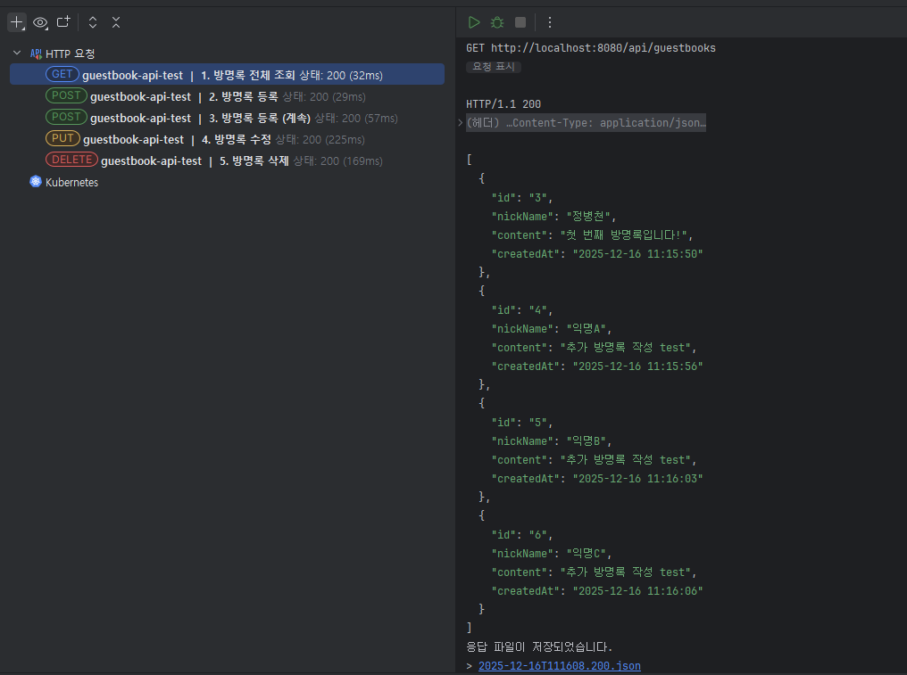

# 프로젝트 회고

## 1. 가장 막혔던 지점

## 2. 이해가 부족하다고 느낀 부분

## 3. 팀 프로젝트 전에 보완하고 싶은 기술

## 4. 혼자 진행하며 느낀 점

---

## 1일차 체크리스트

- [ ] GitHub 리포지토리 생성 및 코드 Push
- [✅] Backend/Frontend 폴더 분리
- [✅] 로컬에서 데이터 저장/조회 성공 스크린샷
- [✅] API 명세서 작성 (docs/02-api-spec.md)

- 작업 중 보완점 
    - 백엔드 작업시 api 삭제요청시 쿼리파라매터값으로 password를 받을려고 했었는데
    - url에 노출되는거 인지하여, 삭제도 그냥 리퀘스트dto로 받게끔 수정 

## 2일차 체크리스트
- [ ] Dockerfile 2개 작성 (Backend, Frontend)
- [ ] docker-compose.yml 작성
- [ ] 로컬에서 docker-compose up 실행 확인
- [ ] AWS EC2에 수동 배포 성공
- [ ] EC2 IP 주소로 서비스 접속 확인

## 3일차 체크리스트
- [ ] GitHub Actions 워크플로우 파일 작성
- [ ] 코드 수정 후 Push → 자동 배포 확인
- [ ] 모든 문서 작성 완료
- [ ] 회고 문서 작성
